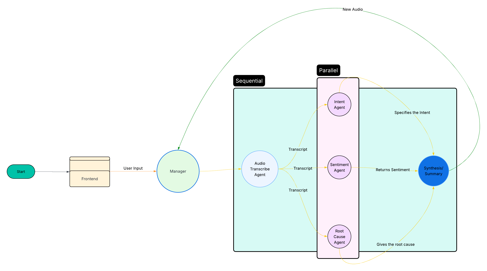

# SAGE - Sentiment Agent-based Guidance Engine

SAGE is an advanced multi-agent AI system designed to analyze customer service audio calls. It leverages a team of specialized AI agents to transcribe, analyze, and report on call data, providing actionable insights for businesses to enhance customer experience, identify operational inefficiencies, and detect emerging trends.

The system is built with a modern Streamlit user interface, allowing users to easily upload audio files, view comprehensive analysis reports, and engage in a follow-up chat to ask deeper questions about the results.

## Features

- **Automated Transcription & Diarization**: Utilizes OpenAI's GPT-4o to generate accurate, speaker-separated transcripts from audio files.
- **In-Depth Call Analysis**: A parallel team of agents work together to identify:
  - **Intent Recognition**: The primary reason for the customer's call.
  - **Sentiment Analysis**: The emotional tone and satisfaction level for each minute of the call.
  - **Root Cause Identification**: The fundamental issue or problem driving the conversation.
- **Comprehensive Reporting**: An agent synthesizes all analysis into a single, well-structured summary report.
- **Interactive Chat**: A chat interface allows users to ask follow-up questions based on the generated report.
- **Persistent Sessions**: All analyses are saved and can be revisited later, including the full report and chat history.
- **Modern Web UI**: A clean, intuitive, and beautiful user interface built with Streamlit.

## Agent Architecture



## Technology Stack

- **Backend**: Python 3.13
- **Frontend**: Streamlit
- **AI Orchestration**: Google Agent Development Kit (ADK)
- **AI Models**:
  - OpenAI GPT-4o (for transcription and diarization)
  - Google Gemini Flash (for analysis and synthesis)
- **Core Libraries**:
  - `google-adk`
  - `streamlit`
  - `openai`
  - `pyannote`
  - `open-whisper`
  - `google-generativeai`
  - `python-dotenv`

## Getting Started

Follow these instructions to set up and run the project on your local machine.

### 1. Prerequisites

- Python 3.10+
- An environment with access to pip.

### 2. Setup and Installation

1.  **Clone the repository:**
    ```sh
    git clone <your-repository-url>
    cd SAGE
    ```

2.  **Create and activate a virtual environment:**
    ```sh
    python -m venv env
    source env/bin/activate
    ```

3.  **Install the required dependencies:**
    ```sh
    pip install -r requirements.txt
    ```

4.  **Configure your environment variables:**
    Create a file named `.env` in the root directory of the project and add your API keys:
    ```env
    OPENAI_API_KEY="your_openai_api_key"
    GOOGLE_API_KEY="your_google_api_key"
    HF_TOKEN="your_hugging_face_api_key"
    ```

### 3. Running the Application

1.  **Launch the Streamlit application:**
    ```sh
    streamlit run sage/ui.py
    ```
2.  Your web browser should open with the SAGE home page.
3.  **To start a new analysis:**
    - Use the file uploader to select an audio file (`.wav`, `.mp3`, `.m4a`).
    - Click the "Analyze File" button.
4.  **To revisit a past analysis:**
    - Find the session in the "Previous Analyses" section.
    - Click the "View Analysis" button.

## Project Structure

```
/SAGE
├── sage/
│   ├── ui.py                # Main Streamlit application UI
│   ├── main.py              # Original CLI application entry point
│   ├── utils.py             # CLI utility functions (logging, colors)
│   ├── manager_agent/       # Contains the main manager agent
│   │   └── agent.py
│   ├── sub_agents/          # Contains all specialized agents
│   │   ├── audio_to_transcript_agent/
│   │   ├── intent_agent/
│   │   ├── root_cause_agent/
│   │   ├── sentiment_agent/
│   │   └── synthesizer_agent/
│   └── uploaded_audio/      # Default directory for uploaded files
├── .env                     # Local environment variables (API keys)
├── requirements.txt         # Project dependencies
└── README.md                # This file
```